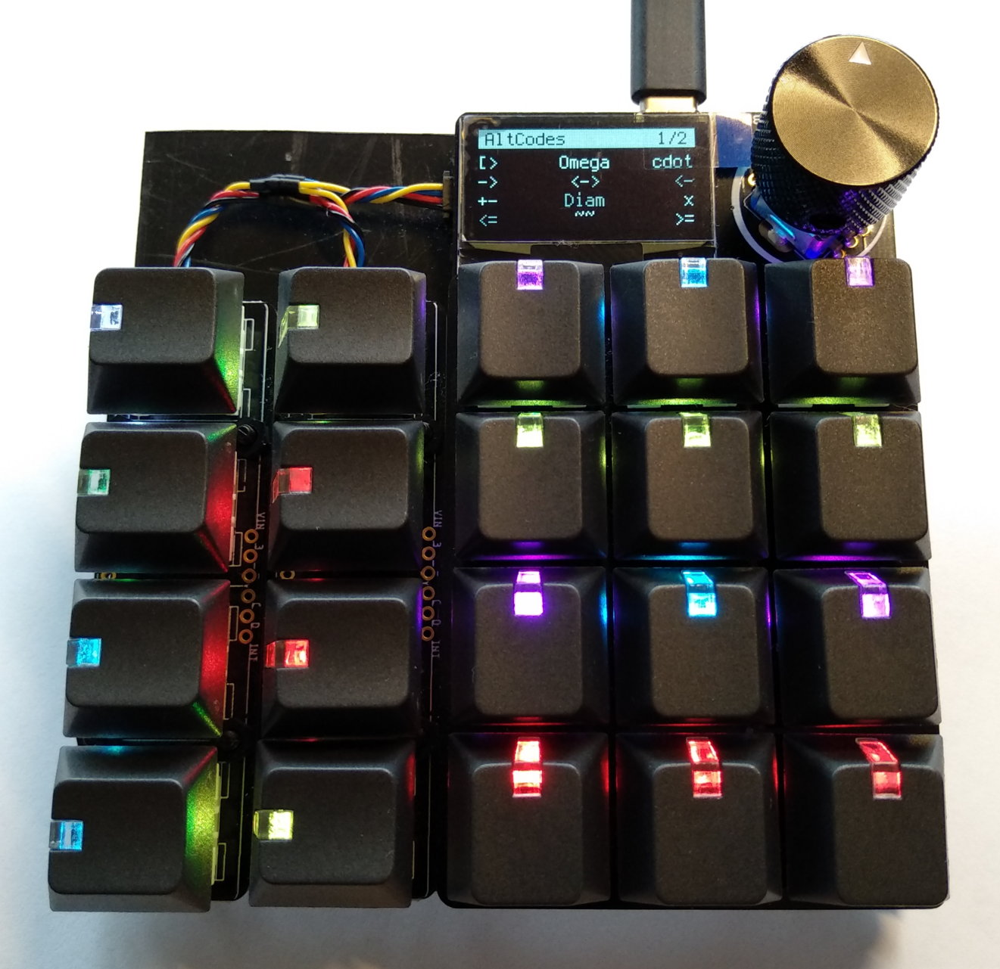
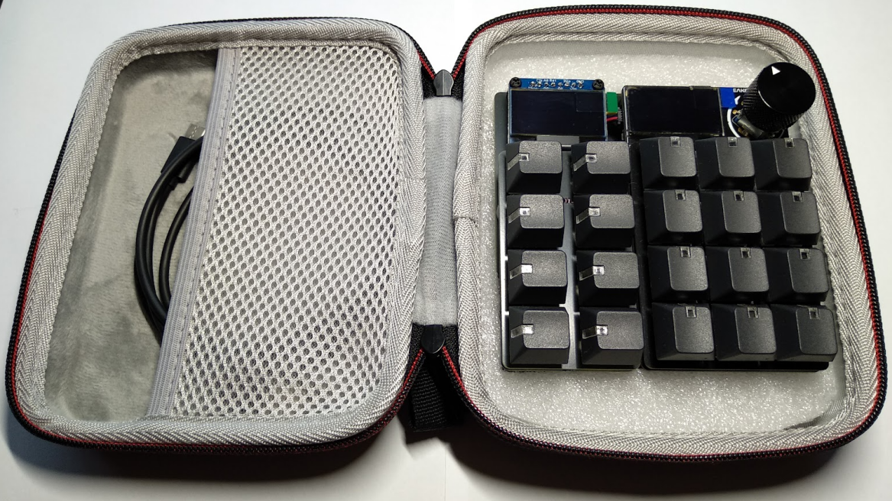

# Ultimate_Adafruit_MacroPad


This repository contains **necessary components** and **fabrication instructions** for my **Ultimate Adafruit Macropad**, as well as the **code and macro-definitions** I run on it. **Configuration and usage instructions** are also listed here.

I've basically added two [NeoKey 1x4 boards](https://www.adafruit.com/product/4980) next to the [Adafruit Macropad](https://www.adafruit.com/product/5128) to simplify macro-layer-switching. I've found that pressing a button to change a macro-layer on the Macropad is much faster than rotating the encoder, certainly if there are (currently) more than 25 layers defined. The encoder is repurposed to change macro-selection-layers on the NeoKey buttons. To have an additional (apart from the button color) indication of what Macropad layer can be activated using a specific NeoKey button, I've also added a [1.3" 128x64 OLED display](https://www.adafruit.com/product/938) above the NeyKey boards.

I've subsequently (heavily) modified the original [Macropad Hotkeys code](https://learn.adafruit.com/macropad-hotkeys?view=all) to work with these additional buttons and display, as wel as added functionality to use other keyboard layouts (using code from [this](https://github.com/Neradoc/Circuitpython_Keyboard_Layouts) repository) and to dim the displays and button-LEDs after some time (using code from [this](https://github.com/M-Eldin/Adafruit-MacroPad-RP2040-Sleep) repository). Since the default firmware on the Macropad doesn't support two displays I've also had to compile new CircuitPython firmware to flash to the Macropad.


<br>

## 0 - Repository Structure

| Folder | Contents |
|---|---|
| [`CIRCUITPY`](CIRCUITPY/) | All files *as-is* on my Ultimate Adafruit Macropad. It contains libraries (`lib`), macros (`macros`), the main `code.py`-file, a quick reference to keycodes (`Keycodes.txt`) and a [VSCode](https://code.visualstudio.com/) workspace (`workspace.code-workspace`) to quickly open some files to I can edit them. |
| [`img`](img/) | Images displayed on this README. |
| [`pcb`](pcb/) | Two (custom) [KiCad](https://www.kicad.org/) PCBs to assemble the Ultimate Adafruit Macropad. |
| [`uf2`](uf2/) | A [CircuitPython](https://circuitpython.org/) firmware-file for the Adafruit Macropad with support for two screens. |

<br>

## 1 - Construction (Hardware)

### 1.1 - Materials

The **Ultimate Adafruit Macropad** is constructed using the materials from the tables below. Note that my version is *very fancy*, with very expensive (but amazing looking) windowed keycaps. These are certainly not required, and instead an [Adafruit MacroPad RP2040 Starter Kit](https://www.adafruit.com/product/5128) with included basic keycaps and switches can also be purchased.

Also note that the NeoKey 1x4 boards ship without switches and keycaps, they need to be purchased separately. In case the [Adafruit MacroPad RP2040 Starter Kit](https://www.adafruit.com/product/5128) is bought (instead of the [Adafruit MACROPAD RP2040 Bare Bones](https://www.adafruit.com/product/5100) board) individual switches and keycaps still need to be purchased for the NeoKey boards.

| Qty | Description | Link |
|---|---|---|
| 1 | Adafruit MACROPAD RP2040 Bare Bones | https://www.adafruit.com/product/5100 |
| 2 | Kailh Mechanical Key Switches - Tactile Brown - 10 pack | https://www.adafruit.com/product/4954 |
| 2 | NeoKey 1x4 QT I2C | https://www.adafruit.com/product/4980 |
| 20 | Black Windowed Lamp R4 Keycap for MX Compatible Switches | https://www.adafruit.com/product/5112 |
| 1 | STEMMA QT / Qwiic JST SH 4-Pin Cable - 50mm Long | https://www.adafruit.com/product/4399 |
| 1 | Monochrome 1.3" 128x64 OLED graphic display - STEMMA QT / Qwiic | https://www.adafruit.com/product/938 |
| 1 | Anodized Aluminum Machined Knob - Black - 20mm Diameter | https://www.adafruit.com/product/5527 |
| 1 | Adafruit MacroPad RP2040 Enclosure + Hardware Add-on Pack | https://www.adafruit.com/product/5103 |
| 1 | Baseboard PCB | (see [these](pcb/ultimate-adafruit-macropad-baseboard/gerber/) gerber-files) |
| 1 | Keyplate PCB | (see [these](pcb/ultimate-adafruit-macropad-keyplate/gerber/) gerber-files) |

Additionally some more generic items are necessary and/or can be useful.

| Description | Usage | Link(s) |
|---|---|---|
| Male (and female) 2.54mm/0.1" pinheaders | Mounting the NeoKey and OLED boards to the Baseboard PCB | https://www.adafruit.com/product/392 https://www.adafruit.com/product/598 |
| Black Nylon Machine Screw and Stand-off Set - M2.5 Thread | Mounting the NeoKey and OLED boards to the Baseboard PCB | https://www.adafruit.com/product/3299 |
| Black Nylon Machine Screw and Stand-off Set - M3 Thread | Mounting the Macropad to the Boaseboard PCB | https://www.adafruit.com/product/4685 |
| 2 pcs Laptop riser feet | Setting the board on an angle for easier usage | https://www.aliexpress.com/item/1005003557570061.html |
| 12x5mm 40 pcs round rubber pads | Making sure the board doesn't slide around | https://www.aliexpress.com/item/33030992785.html |
| Carrying case | Protecting the board during travel | https://www.aliexpress.com/item/1005001855670902.html |

<br>

### 1.2 - Assembly

As the last two entries in the first material-table already suggested, I've also designed two custom PCBs to facilitate a fairly easy assembly and final sturdy device. The [Baseboard PCB](pcb/ultimate-adafruit-macropad-baseboard/) is used to mount all boards to a single PCB, while also facilitating some interconnections between the components. Only a single Stemma QT / Qwiic cable (in an out-of-sight spot) is required, the rest of the connections are done by the Baseboard.

The second PCB, the [Keyplace PCB](pcb/ultimate-adafruit-macropad-keyplate/), is used to secure the eight mechanical switches to the two NeoKey boards. It basically has the same functionality as the keyplace-PCB does for the Adafruit Macropad (included in the [Adafruit MacroPad RP2040 Enclosure + Hardware Add-on Pack](https://www.adafruit.com/product/5103) or [Adafruit MacroPad RP2040 Starter Kit](https://www.adafruit.com/product/5128)).

#### The assembly-steps are the following

1. Solder male 2.54mm/0.1" pinheaders to the Baseboard (one with 01x08 pins for the OLED, two with 01x06 pins for the NeoKey boards).
2. Close solder-jumper `A0` of the left-most NeoKey 1x4 board to set its I2C address to `0x31`. The right-most NeoKey 1x4 board will keep its default address of `0x30`.
3. Solder female 01x06 2.54mm/0.1" headers to the NeoKey boards.
4. Solder a female 01x08 2.54mm/0.1" header to the OLED display. Also cut the mounting-holes on the bottom of this board so it can be mounted closer to the NeoKey boards.
5. Screw the Macropad to the Baseboard using M3 hardware.
6. Screw the NeoKey boards to the Baseboard using M2.5 hardware.
7. Connect the STEMMA QT / Qwiic cable from the Macropad to the top of the left-most NeoKey board.
8. Screw the OLED display to the Baseboard using M2.5 hardware.
9. Mount the mechanical keys to the Macropad. Make sure to not forget the keyplate in between the Macropad and the keys.
10. Mount the mechanical keys to the NeoKey boards. Make sure to not forget the (custom) keyplate in between the boards and the keys.
11. Mount the rotary encoder knob on the rotary encoder. Put the keycaps on the mechanical switches. Mount the riser feet to the bottom of the Baseboard.
12. (Optional, if the carrying case is used): Cut a foam-insert for the inside of the case to keep the Ultimate Adafruit Macropad from moving around.

|  |  |
|--|--|

<br>

## 2 - Firm/Software

### 2.1 - Firmware

As already mentioned, the default [CircuitPython](https://circuitpython.org/) firmware for the Adafruit Macropad doesn't support two screens. Fortunately it is possible to build `.uf2`-files yourself which do support this. The result of this is placed in the [`uf2`](uf2/) directory on this repository.

<details>

  <summary>For reference, the following (Linux/Ubuntu) steps/commands can be used to build the file yourself</summary>
  
  ```bash
  ## https://learn.adafruit.com/building-circuitpython/linux
  # Install additional software
  sudo apt install build-essential
  sudo add-apt-repository ppa:git-core/ppa
  sudo add-apt-repository ppa:pybricks/ppa
  # Download the appropriate ARM Cortex-M toolchain
  # (for CircuitpPython 8.x: 10-2020-q4-major https://developer.arm.com/downloads/-/gnu-rm)
  # Unpack it in a convenient directory
  mkdir ~/bin
  cd ~/bin
  tar xvf gcc-arm-none-eabi-10-2020-q4-major-x86_64-linux.tar.bz2
  # Add a link to the toolchain executables in PATH
  sudo nano ~/.profile
    export PATH=/home/$USER/bin/gcc-arm-none-eabi-10-2020-q4-major/bin:$PATH
  # Logout and log back in
  # Check if the link is correctly configured
  which arm-none-eabi-gcc

  ## https://learn.adafruit.com/building-circuitpython/build-circuitpython
  # Clone the repository
  git clone https://github.com/adafruit/circuitpython.git
  cd circuitpython
  # Install needed Python packages from pypi.org.
  pip3 install --upgrade -r requirements-dev.txt
  pip3 install --upgrade -r requirements-doc.txt
  # Checkout the latest stable branch (as per https://circuitpython.org/board/adafruit_macropad_rp2040/)
  git checkout 8.2.8
  # Fetch submodules (for a specific ports/... device)
  cd ports/raspberrypi
  make fetch-port-submodules
  # Build mpy-cross
  cd ../..
  make -C mpy-cross

  ## https://todbot.com/blog/2022/05/19/multiple-displays-in-circuitpython-compiling-custom-circuitpython/
  # Build for the Adafruit Macropad, with the display limit set to "2"
  cd ports/raspberrypi
  echo "#define CIRCUITPY_DISPLAY_LIMIT (2)" >> boards/adafruit_macropad_rp2040/mpconfigboard.h
  make -j12 BOARD=adafruit_macropad_rp2040
  ```

</details>

#### The firmware flashing steps are the following

1. Make sure the board is plugged-in to a computer
2. Quickly double-press the <kbd>reset</kbd> button on the Macropad to put it in the "firmware flashing" mode.
   1. If correctly activated a `RPI-RP2` drive shows up on the computer.
   2. If this doesn't work, use the following sequence to activate this mode.
      1. Hold down the encoder push-button
      2. Press the <kbd>reset</kbd> button
      3. Release the encoder push-button
3. Copy the `.uf2`-file to the `RPI-RP2` drive
4. Wait some time for the flashing to be complete

<br>

### 2.2 - Libraries (and other files)

After the firmware has been updated, the necessary libraries (and other files) need to be copied to the (Ultimate) Adafruit Macropad. One can simply copy all contents inside the [`CIRCUITPY`](CIRCUITPY/) directory of this repository to the Macropad.

<br>

### 2.3 - Software Configuration

#### 2.3.1 - Main Code

If all of the necessary files are copied to the Macropad, the customization can begin. [`CIRCUITPY/code.py`](CIRCUITPY/code.py) is the main configuration file. The macro-definitions can be found in [`CIRCUITPY/macros`](CIRCUITPY/macros). All of the files start with a number so they are sorted in a specific order. The number is also used to configure the NeoKey layers (`NEOKEY_BUTTONS`).

Inside [`CIRCUITPY/code.py`](CIRCUITPY/code.py) are a few configuration-variables to change some functionality.

- `KEYBOARD_LAYOUT`
  - `KEYBOARD_LAYOUT = 0`: Select <kbd>US QWERTY</kbd> as keyboard layout.
  - `KEYBOARD_LAYOUT = 1`: Select <kbd>Belgian AZERTY</kbd> as keyboard layout (*default*).
  - `KEYBOARD_LAYOUT = 2`: Select my <kbd>Custom Belgian AZERTY</kbd> keyboard layout where the numbers and characters on the number-row are swapped around.
- `MACRO_FOLDER`
  - `MACRO_FOLDER = '/macros'`: Select the folder where the code looks for macro-definitions.
- `NEOKEY_BUTTONS_START_LAYER`: Select the start-up NeoKey button-layer.
- `NEOKEY_BUTTONS_START_BUTTON`: Select the start-up NeoKey button.
- `NEOKEY_BUTTONS`
  - This is the NeoKey layer-definition. Layers can be changed by turning the rotary encoder on the Macropad.
  - The definition-syntax is loosely based on those of the the macro-definitions. The structure is the following (below is an example of a layer-definition).
    - A layer always needs a title-text (although it can be a zero-length string). The title is displayed on the first line of the OLED display above the NeoKey buttons.
    - The button-row definitions very closely resemble the functionality of the Macropad macro-definitions. The necessary fields are the following.
      1. A hexadecimal color-code to light-up the NeoKey button in case the page is not activated. If the layer is selected (after a button-press on the NeoKey) the key itself lights up white.
      2. A (short) text explaining the functionality present on the layer(s) which can be activated with this button. The text is also displayed in the corresponding button-location on the OLED display above the NeoKeys. The text on the screen of an activated layer also gets inverted.
      3. A list of numbers corresponding to the Macropad layers which can be activated (or cycled) after pressing a specific NeoKey button. The numbers are the same starting-numbers from the files in [`CIRCUITPY/macros`](CIRCUITPY/macros).
         - In case no macros need to be bound to a NeoKey button, make sure to still enter a (placeholder) file-number in this list. An "unused" button should have the following syntax: `(0x000000, "", [0]),`
- `TIMEOUT_S`
  - `TIMEOUT_S = 10 * 60`: Set the timeout to 10 minutes, after which the OLED displays and button-LEDs will dim. All button-functionality however still remains active.

```python
NEOKEY_BUTTONS = [
  [
    # Layer title
    "Base [1/3] AltiumSch",
    # Button definitions
    [
        # First row
        (0x004000, "AltCode1,2", [0, 1]),   # Alt-codes 1 & 2
        (0x404000, "Base,Queri", [3, 24]),  # Altium Schematic 1 & Validation Queries
        # Second row
        (0x000040, "Word1,4",    [2, 16]),  # Word 1 & 4
        (0x404000, "Hierarch",   [4]),      # Altium Schematic 2
        # Third row
        (0x000040, "Word2,3",    [20, 23]), # Word 2 & 3
        (0x404000, "Varia,Algn", [5, 22]),  # Altium Schematic 3 & Alignment
        # Fourth row
        (0x004040, "Outl,Excl",  [18, 26]), # Outlook & Excel
        (0x404000, "Col,NetCol", [15, 11])  # Altium Colors & Net-colors
    ]
  ],
]
```

<br>

#### 2.3.2 - Macropad layer-definitions

The build-up of the macro-file definitions ([`CIRCUITPY/macros`](CIRCUITPY/macros)) is unchanged compared to those of a "regular" Adafruit Macropad, and thus can perfectly be used in a "barebones" setup. Because of this the syntax won't be explicitly explained here, only some "tricks" I used when defining my macro-files.

- When there is a ``` ` ```-character at the **front** of a macro-label on the OLED display, it means a right-click mouse-action is used.
- When there is a ``` ` ```-character at the **end** of a macro-label on the OLED display, it means some sort of custom keyboard-shortcut was used. Or, in the case of the Altium *color*-pages, a non-standard color was defined.

<br>

## 3 - Usage

With the **Ultimate Adafruit Macropad** macro-definition-pages can be switched to by simply pressing one of the NeoKey buttons on the left of the Macropad, instead of rotating the encoder. The OLED display above the NeoKey buttons is used to show informating regarding these Macropad layers. The LED of the last selected (group of) page(s) lights up bright white, and the text on the OLED is inverted. The other NeoKey LEDs light up according to their defined color in `NEOKEY_BUTTONS` in the [`CIRCUITPY/code.py`](CIRCUITPY/code.py) file.

The latter file is used to do the main configuration, such as defining which Macropad layers (placed in [`CIRCUITPY/macros`](CIRCUITPY/macros)) can be activated using which NeoKey buttons. When there are multiple macro-definition-pages linked to a single NeoKey button (more than one number in the square brackets in `NEOKEY_BUTTONS`), subsequent presses on the same key rotate between all pages defined in the list. The last selected page is remembered in case another NeoKey button is pressed to select another (group of) page(s), or a whole NeoKey layer is changed using the rotary encoder. The first line on the OLED display above the NeoKey buttons also shows a title of the current layer, which is also configured in [`CIRCUITPY/code.py`](CIRCUITPY/code.py).
