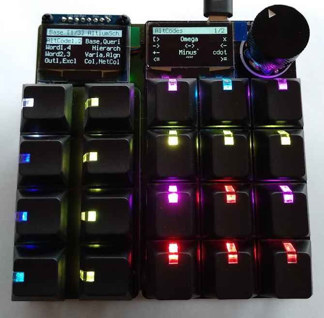

# Ultimate_Adafruit_MacroPad

<!--
[GitHub Release Date](https://img.shields.io/github/release-date/Fescron/Ultimate_Adafruit_MacroPadsvg)
[GitHub release](https://img.shields.io/github/release/Fescron/Ultimate_Adafruit_MacroPad.svg)
-->

This repository contains **fabrication-instructions** for my **Ultimate Adafruit Macropad** as well as the **code and macro-definitions** I run on it. **Configuration and usage instructions** are also listed here.

I've basically added two [NeoKey 1x4 boards](https://www.adafruit.com/product/4980) next to the [Adafruit Macropad](https://www.adafruit.com/product/5128) to simplify macro-layer-switching. I've found that pressing a button to change a macro-layer on the Macropad is much faster than rotating the encoder. The latter is now used to change macro-selection-layers on the NeoKey-buttons.

I've thus modified the original [Macropad Hotkeys](https://learn.adafruit.com/macropad-hotkeys?view=all) code to work with these additional buttons, as wel as added additional functionality to use other keyboard-layouts (using code from [this](https://github.com/Neradoc/Circuitpython_Keyboard_Layouts) repository) and to dim the display and button-LEDs after some time (using code from [this](https://github.com/M-Eldin/Adafruit-MacroPad-RP2040-Sleep) repository).

 

## 1 - Construction

The **Ultimate Macropad** is constructed using the materials from the table below. Note that my version is *very fancy* with very expensive (but amazing looking) windowed keycaps. These are certainly not required, and instead an [Adafruit MacroPad RP2040 Starter Kit](https://www.adafruit.com/product/5128) with included basic keycaps and switches can also be purchased.

Note that the NeoKey 1x4 boards ship without switches and keycaps, they need to be purchased separately. So when the [Adafruit MacroPad RP2040 Starter Kit](https://www.adafruit.com/product/5128) is bought (instead of the [Adafruit MACROPAD RP2040 Bare Bones](https://www.adafruit.com/product/5100) board) individual switches and keycaps still need to be purchased for the NeoKey boards.

| Qty | Description | Link |
|---|---|---|
| 1 | Adafruit MACROPAD RP2040 Bare Bones | https://www.adafruit.com/product/5100 |
| 2 | Kailh Mechanical Key Switches - Tactile Brown - 10 pack | https://www.adafruit.com/product/4954 |
| 2 | NeoKey 1x4 QT I2C | https://www.adafruit.com/product/4980 |
| 20 | Black Windowed Lamp R4 Keycap for MX Compatible Switches | https://www.adafruit.com/product/5112 |
| 2 | STEMMA QT / Qwiic JST SH 4-Pin Cable - 50mm Long | https://www.adafruit.com/product/4399 |
| 1 | Anodized Aluminum Machined Knob - Black - 20mm Diameter | https://www.adafruit.com/product/5527 |
| 1 | 2 pcs Laptop riser feet | https://www.aliexpress.com/item/1005003557570061.html |
| | Base-plate + M2.5/M3 mounting hardware | |

As the last line from the table implies, I've made a custom base-plate with some holes in it to mount everything to. In the future (**TODO**) I might create a custom PCB with the correct holes as well as a way to connect the two NeoKey 1x4's together with headers instead of cables. This way the STEMMA QT/Qwiic cables don't need to be soldered together in a "Y" formation as to not have a cable sticking out on the bottom, connecting the two boards together. Additionally another board needs to be made (**TODO**) to make sure all of the switches are held together nice and tight.

The dimensions of this plate and the holes in it are depicted below. The holes for the NeoKey boards are M2.5 (about 2.7mm in diameter), those for the Macropad are M3 (about 3.2mm in diameter).

The left-most NeoKey 1x4 board needs to have solder-jumper `A0` closed to set its I2C address to `0x31`. The right-most NeoKey 1x4 board will keep its default address of `0x30`.

 

## 2 - Configuration

The code I've (re)written as well as all of my constructed macro-definitions can be found in the [`CIRCUITPY`](CIRCUITPY) folder. If the Macropad has the latest firmware (see also [this](https://learn.adafruit.com/macropad-hotkeys/circuitpython)) you can just copy all of the files inside of this folder to your Adafruit Macropad.

The macro-definitions can be found in [`CIRCUITPY/macros`](CIRCUITPY/macros). All of the files start with a number so they are sorted in a specific order. The number is also used to configure the NeoKey layers (see `neokey_buttons` below).

 

Inside [`CIRCUITPY/code.py`](CIRCUITPY/code.py) are a few configuration-variables to change some functionality.

- `KEYBOARD_LAYOUT` 
  - `KEYBOARD_LAYOUT = 0`: Select <kbd>US QWERTY</kbd> as keyboard-layout.
  - `KEYBOARD_LAYOUT = 1`: Select <kbd>Belgian AZERTY</kbd> as keyboard-layout.
  - `KEYBOARD_LAYOUT = 2`: Select my <kbd>Custom Belgian AZERTY</kbd> keyboard-layout where the numbers and characters on the number-row are swapped around.
- `MACRO_FOLDER`
  - `MACRO_FOLDER = '/macros'`: Select the folder where the code looks for macro-definitions.
- `TIMEOUT_S`
  - `TIMEOUT_S = 10 * 60`: Set the timeout to 10 minutes, after which the OLED-display and button-LEDs will dim but all still are active.
- `neokey_buttons`
  - The NeoKey-layer-definition. Layers can be changed by turning the rotary-encoder on the Macropad.
  - The definition-syntax is loosely based on the macro-definitions.
  - Example: `(0x004000, [0, 1]),`
    - `0x004000`: Defines the color (hexadecimal) of the NeoKey-LED which is displayed when the layer is not selected. If the layer is selected (after a button-press on the NeoKey) the key itself lights up white.
    - `[0, 1]`: A list of numbers corresponding to the starting-numbers from the files in [`CIRCUITPY/macros`](CIRCUITPY/macros). `[0, 1]` will make sure to alternately switch between selecting the macro-definition-file starting with `(0)0` or `(0)1` for the Macropad.

 

## 3 - Usage

With the **Ultimate Macropad** macro-definition-pages can be switched to by simply pressing one of the NeoKey buttons. The LED of the last selected (group of) page(s) lights up bright white, the other NeoKey LEDs light up according to their defined color in `neokey_buttons` in the [`CIRCUITPY/code.py`](CIRCUITPY/code.py) file.

When there are multiple macro-definition-pages linked to a single NeoKey button (more than one number in the square brackets in `neokey_buttons`), subsequent presses on the same key rotate between all pages defined in the square brackets. The last selected page is remembered in case another NeoKey button is pressed to select another (group of) page(s) or a whole NeoKey layer is changed using the rotary-encoder.

 

